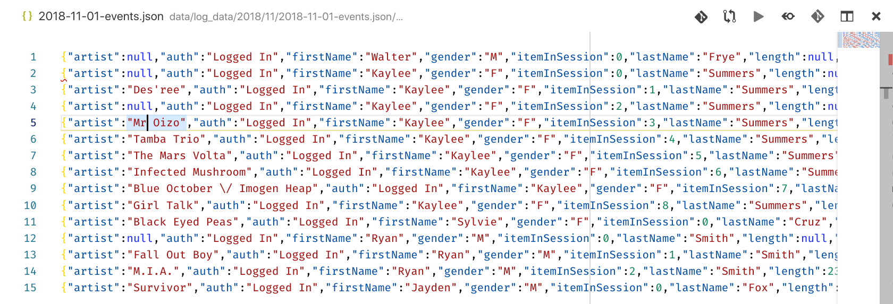

# Data Engineer Nanodegree

## Data Modeling

## Project: Data Modeling with Postgres

## [Blog Version](https://medium.com/@sanjeevai/data-modeling-with-postgres-20059b57013b)

## Table of Contents

- [Introduction](#intro)
- [Description](#describe)
- [Data](#data)
  - [Song Dataset](#song)
  - [Log Dataset](#log)
- [Schema for Song Play Analysis](#schema)
  - [Fact Table](#fact)
  - [Dimension Tables](#dim)
- [Process Song Data](#p_song)
- [Process Log Data](#p_log)
- [Files](#files)
- [Software Requirements](#sw_reqs)
- [Conclusion](#conclusion)

***

<a id="intro"></a>

## Introduction

A startup called Sparkify wants to analyze the data they've been collecting on
songs and user activity on their new music streaming app. The analytics team is
particularly interested in understanding what songs users are listening to.
Currently, they don't have an easy way to query their data, which resides in a
**directory of JSON logs** on user activity on the app, as well as a **directory
with JSON metadata** on the songs in their app.

They need a data engineer to create a **Postgres** database with tables designed
to **optimize queries on song play analysis.** Our role is to create a **database
schema** and **ETL pipeline** for this analysis. Then we'll test our database and ETL
pipeline by running queries given by the analytics team from Sparkify and
compare our results with their expected results.

<a id="describe"></a>

## Description

In this project, We'll apply the concepts learned in data modeling with Postgres
and build an ETL pipeline using Python. We will define **fact and dimension tables**
for a star schema for a particular analytic focus, and write an ETL pipeline
that transfers data from files in two local directories into these tables in
Postgres using **Python** and **SQL.**

<a id="data"></a>

## Data

<a id="song"></a>

### Song Dataset

The first dataset is a subset of real data from the [Million Song
Dataset](https://labrosa.ee.columbia.edu/millionsong/). Each file is in JSON
format and contains metadata about a song and the artist of that song. The files
are **partitioned by the first three letters** of each song's track ID. For example,
here are filepaths to two files in this dataset.

<pre>
data/song_data/A/B/C/TRABCEI128F424C983.json
data/song_data/A/A/B/TRAABJL12903CDCF1A.json
</pre>

And below is an example of what a single song file, _TRAABJL12903CDCF1A.json_,
looks like.

<pre>
{"num_songs": 1, "artist_id": "ARJIE2Y1187B994AB7", "artist_latitude": null, "artist_longitude": null, "artist_location": "", "artist_name": "Line Renaud", "song_id": "SOUPIRU12A6D4FA1E1", "title": "Der Kleine Dompfaff", "duration": 152.92036, "year": 0}
</pre>

<a id="log_data"></a>

### Log Dataset

The second dataset consists of log files in JSON format generated by this [event
simulator](https://github.com/Interana/eventsim) based on the songs in the
dataset above. These simulate app activity logs from a music streaming app based
on specified configurations.

The log files in the dataset we'll be working with are **partitioned by year and
month.** For example, here are filepaths to two files in this dataset.

<pre>
data/log_data/2018/11/2018-11-12-events.json
data/log_data/2018/11/2018-11-13-events.json
</pre>

And below is an example of what the data in a log file, _2018-11-12-events.json_,
looks like.


If you would like to look at the json data within log_data files, you will need to create a Pandas df to read the data. Remember to first import _json_ and _pandas_ libraries.

```python
df = pd.read_json(filepath, lines=True)
```

> Note: Make sure to set `lines= True` so that each line of the JSON file is read as a new row.

For e.g., `df = pd.read_json('data/log_data/2018/11/2018-11-01-events.json', lines=True)` would read the data file _2018-11-01-events.json_

Here is a helpful [video](https://www.youtube.com/watch?v=hO2CayzZBoA) from **Udacity's Data Wrangling course** talking about the JSON files format.

<a id="schema"></a>

## Schema for Song Play Analysis

Using the song and log datasets, we'll create a star schema optimized for queries
on song play analysis. This includes the following tables.

<a id="fact"></a>

### Fact Table

1. **songplays** - records in log data associated with song plays, i.e., records with
  page `NextSong`
    - *songplay_id, start_time, user_id, level, song_id, artist_id, session_id,
      location, user_agent*

<a id="dim"></a>

### Dimension Tables

2. **users** - Following information about users:
    - *user_id, first_name, last_name, gender, level*

3. **songs** - Following info about songs:
    - *song_id, title, artist_id, year, duration*

4. **artists** - Artists information:
    - *artist_id, name, location, latitude, longitude*

5. **time** - timestamps of records in **songplays** broken down into specific units
    - *start_time, hour, day, week, month, year, weekday*

In order to create these tables, all we need to do is perform some transformation in the data which are already in song_data and log_data directory.

<a id='p_song'></a>

## Process Song Data

We will perform ETL on the files in *song_data* directory to create two dimensional tables: `songs` table and `artists` table.

This is what a songs file looks like:

<pre>
{"num_songs": 1, "artist_id": "ARD7TVE1187B99BFB1", "artist_latitude": null, "artist_longitude": null, "artist_location": "California - LA", "artist_name": "Casual", "song_id": "SOMZWCG12A8C13C480", "title": "I Didn't Mean To", "duration": 218.93179, "year": 0}
</pre>

For songs table, we'll extract data for songs table by using only the columns corresponding to the songs table suggested in the star schema above. Similarly, we'll select the appropriate columns for artists table.

```python
song_data = df[["song_id", "title", "artist_id", "year", "duration"]].values[0]
song_data
# Looks like this
# array(['SONHOTT12A8C13493C', 'Something Girls', 'AR7G5I41187FB4CE6C', 1982, 233.40363], dtype=object)

artist_data = df[["artist_id", "artist_name", "artist_location", "artist_latitude", "artist_longitude"]].values[0]
artist_data
# Looks like this
# array(['AR7G5I41187FB4CE6C', 'Adam Ant', 'London, England', nan, nan], dtype=object)
```

Now insert the extract data into their respective tables.

```python
cur = conn.cursor
# insert songs data
cur.execute(song_table_insert, song_data)
conn.commit()

# insert artists data
cur.execute(artist_table_insert, artist_data)
conn.commit()

### `conn` is the connection to Postgres database which establishes successfully
### after providing proper parameters like host, dbname, user, password
```

Variables *song_table_insert* and *artist_table_insert* are SQL queries. These are given in sql_queries.py file.

<a id='p_log'></a>

## Process Log Data

We will perform ETL on the files in *log_data* directory to create the remaining two dimensional tables: `time` and `users`, as well as the `songplays` fact table.

This is what a single log file looks like.



For `time` table we have `ts` column in log files. We will parse it as a time stamp and use python's datetime functions to create the remaining columns required for the table mentioned in the above schema.

```python
# filter specifies that user has played a song
df = df.query(" page == 'NextSong' ")

# converting to timestamp
t = pd.to_datetime(df["ts"]/1000, unit = 's')

# creating different unit based on hour, day, etc.
time_data = np.transpose(np.array([df["ts"].values, t.dt.hour.values, t.dt.day.values, t.dt.week.values, t.dt.month.values, t.dt.year.values, t.dt.weekday.values]))

# specifying column names for the same
column_labels = ("timestamp", "hour", "day", "week of year", "month", "year", "weekday")

# creating a separate df
# we will use this when inserting data to time table
time_df = pd.DataFrame(data = time_data, columns = column_labels)
```

For `users` table, we'll extract the appropriate columns from log files as mentioned in the star schema above for `users` table.

```python
user_df = df[["userId", "firstName", "lastName", "gender", "level"]]
```

For `songplays` table, we will require information from `songs` table, `artists` table and the original log files. Since the log files do not have `song_id` and `artist_id`, we need to use `songs` table and `artists` table for that. The *song_select* query finds the `song_id` and `artist_id` based on the *title, artist_name,* and *duration* of a song. For the remaining columns, we can select them from the log files.

```python
for index, row in df.iterrows():

    # get songid and artistid from song and artist tables
    cur.execute(song_select, (row.song, row.artist, row.length))
    results = cur.fetchone()
    
    if results:
        songid, artistid = results
    else:
        songid, artistid = None, None

    # insert songplay record
    songplay_data = (row.ts, row.userId, row.level, songid, artistid, row.sessionId,\
                     row.location, row.userAgent)
    
    cur.execute(songplay_table_insert, songplay_data)
    conn.commit()
```

Now insert the data into their respective tables.

```python
# insert into time table
for i, row in time_df.iterrows():
    cur.execute(time_table_insert, list(row))
    conn.commit()

# insert into users table
for i, row in user_df.iterrows():
    cur.execute(user_table_insert, row)
    conn.commit()
```
<a id="files"></a>

## Files

<pre>
.
├── create_tables.py------# Drops and creates tables. Running this file resets
|                           the tables before each time we run ETL scripts.
├── etl.ipynb-------------# Reads and processes a single file from song_data and
|                           log_data and loads the data into our tables.
├── etl.py----------------# Reads and processes files from song_data and
|                           log_data and loads them into our tables. We'll fill
|                           this based on ETL notebook.
├── sql_queries.py--------# Contains all our SQL queries, and is imported into
|                           the last three files above.
└── test.ipynb------------# Displays the first few rows of each table to let us
                            check our database.
</pre>

<a id="sw_reqs"></a>

## Software Requirements

This project requires Python 3.6.x and the necessary libraries are mentioned in _requirements.txt._

<a id="conclusion"></a>

## Conclusion

We created a Postgres database from the two JSON directories. We extracted data from two directories, applied transformation, filtering, and then inserting the transformed data into appropriate tables.

This data can now be used for ad-hoc queries, basic aggregation and analytics purposes.
